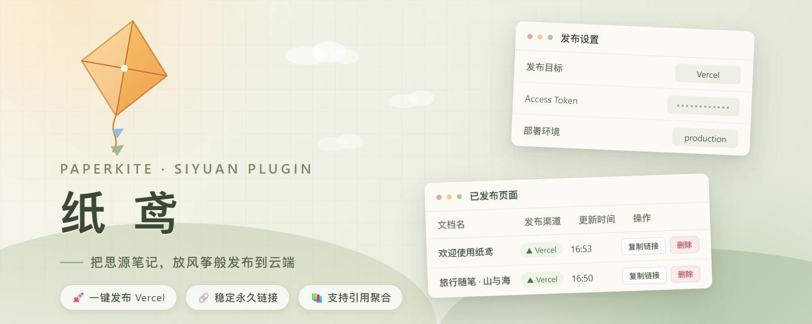

# PaperKite

Let a document fly. PaperKite turns the currently open SiYuan document into a self-contained static page and hosts it on a project you already own (Cloudflare Pages or Vercel), then hands you the link.

[中文](./README.zh-CN.md)


## How it works

1. `/api/export/exportPreviewHTML` provides the document HTML — the same rendering SiYuan uses for its own HTML export.
2. The stylesheets of the active theme are read from the kernel (same origin): `stage/build/export/base.css`, `appearance/themes/<theme>/theme.css`, the KaTeX stylesheet and the code highlight theme, together with the fonts they reference. The published page therefore keeps your current theme.
3. Math and code highlighting are rendered **at publish time** with SiYuan's bundled KaTeX / highlight.js, so the uploaded page contains no JavaScript.
4. Referenced `assets/` and `emojis/` files are uploaded under their original paths.
5. The selected platform uploads the result. The site is a single `index.html` plus static files.

Every outbound request is forwarded by the kernel through `/api/network/forwardProxy`: `api.cloudflare.com` does not answer `OPTIONS`, so a frontend request carrying an `Authorization` header always fails its CORS preflight.

Content generation and upload are separate: `src/publish/site-builder.ts` only produces `SiteFile[]`, and `src/publish/provider.ts` dispatches to a platform. Adding a platform does not touch the content pipeline.

## Setup: Cloudflare Pages

1. Create a Pages project of type **Direct Upload**. Git-integrated projects cannot be used here, and the type cannot be changed after creation. The API is the quickest route:

   ```bash
   curl -X POST "https://api.cloudflare.com/client/v4/accounts/$ACCOUNT/pages/projects" \
     -H "Authorization: Bearer $TOKEN" -H "Content-Type: application/json" \
     --data '{"name":"siyuan-notes","production_branch":"main"}'
   ```

2. Create an API Token with `Account` → `Cloudflare Pages` → `Edit`.
3. In the plugin settings set "Publish target" to Cloudflare Pages and fill in the Account ID, project name, token and branch.

Upload uses Direct Upload: `upload-token` → `check-missing` → `upload` → `upsert-hashes` → `deployments`. The asset key is `blake3(base64(content) + extension)` truncated to 32 hex characters.

## Setup: Vercel

1. Create a Vercel project and do **not** connect it to Git (a Git-connected project works, but the two sources will overwrite each other).
2. Create an Access Token under account settings → Tokens, scoped to the account or team that owns the project.
3. In the plugin settings set "Publish target" to Vercel and fill in the token and project name; team projects also need the Team ID.

Upload uses the non-Git deployment flow: each file is sent to `POST /v2/files` (`x-vercel-digest` is the sha1 of the file content), then `POST /v13/deployments` references them by sha. `projectSettings.framework` is `null`, so Vercel runs no build and serves the files as-is.

## Usage

- Top bar icon → "Publish current document"
- Or the command with the same name in the command palette

The click first opens the "Export options" dialog; the publish starts once the page layout is confirmed. The deployment URL is copied to the clipboard when the publish succeeds.

### Export options

Every option can be changed per publish, and the confirmed values become the defaults of the next one (stored in `data/storage/petal/siyuan-upload-pages/publish-template.json`):

- **Show the document title on top of the page**
- **Maximum content width**: a CSS length, for example `800px`
- **Include the documents referenced by the body**: SiYuan's export turns the references in the body into footnotes and appends the referenced content as a footnote section; on top of that, documents behind block references, document links and embed blocks are appended as sections. Only one level is followed — references inside included content stay plain text. Turning this off removes the footnote section and its markers as well
- **Show a table of contents on the right**: static anchor links only; it moves above the article on narrow screens (≤1100px)
- **List the included referenced documents too**: needs both options above; the headings of the included content form their own group behind a separator


**Link stability**: a production deployment (Cloudflare production branch / Vercel `production` target) returns the project's fixed domain (Cloudflare: `<project>.pages.dev`; Vercel: the project's assigned `<name>.vercel.app` domain), so republishing updates the content under the same link. Preview deployments (non-production branch / `preview` target) get a new platform-generated URL every time.

### Publish records and republishing

Every publish leaves a record in the plugin data (channel, document name and id, URL, publish time and update time). Publishing the same document again:

- **Unchanged page** (the built files match the fingerprint of the last publish): nothing is re-uploaded — the plugin reports the existing record and copies the current link;
- **Changed page**: it redeploys and refreshes the record (the original publish time is kept, the update time advances).

Records are tracked per channel + document: publishing the same document to both Cloudflare Pages and Vercel keeps two independent records.

### Managing published pages

Top bar icon → "Manage published pages", or plugin settings → "Published pages" → "Manage published pages". For every record you can:

- **Copy link**: puts the deployment URL on the clipboard (hover the button to see the full URL);
- **Copy ID**: copies the document id (hover the button to see it);
- **Delete** the publish: after a confirmation it removes the remote deployment and the local record. When the channel credentials are missing the remote deployment cannot be deleted, and you may drop just the local record. Deleting a record is also the way to force a fresh deploy of an unchanged page.

Records are stored in `data/storage/petal/siyuan-upload-pages/publish-records.json`.

## Development

```bash
pnpm install
pnpm run dev          # emits to dev/, use together with make-link
pnpm run build        # emits to dist/ and packs package.zip
pnpm run check        # tsc + svelte-check
```

## Limitations

- One document per publish; the site holds one `index.html` per document. With "include the documents referenced by the body" enabled, the referenced documents are merged into that same page.
- Block references that are not included cannot resolve on the page and degrade to plain text.

- Diagrams that need runtime rendering (Mermaid, ECharts, flowcharts) are not processed and fall back to their source text.
- Vercel has no batch upload endpoint, so it sends one request per file (6 in parallel). It still makes more requests than Cloudflare's batched upload.

- Tokens are stored with the plugin data in this workspace (`data/storage/petal/siyuan-upload-pages/publish-config.json`). Do not share that file.
